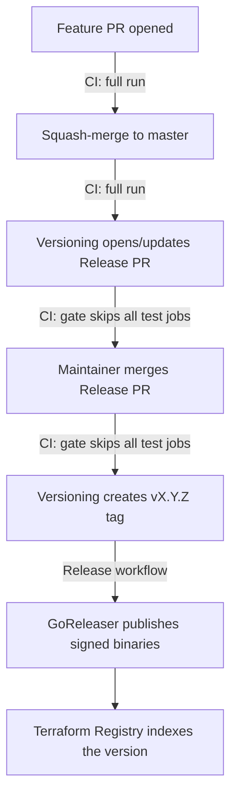

# CI and release pipeline

Human-oriented map of how a change travels from a pull request to a published
release, and why the pipeline skips work it doesn't need. For the
release/registry runbook see [RELEASE.md](RELEASE.md); this document covers
the CI mechanics.

## Workflows at a glance

| Workflow | File | Trigger | Purpose |
|---|---|---|---|
| CI | `.github/workflows/ci.yml` | PR, push to `master` | Lint, unit tests + coverage floor, docs drift/schema checks, Trivy and govulncheck security gates, acceptance tests |
| CodeQL | `.github/workflows/codeql.yml` | PR, push to `master`, weekly cron | Static security analysis (Go) |
| PR Title Check | `.github/workflows/pr-title.yml` | PR | Enforces Conventional Commit PR titles (they become the squash-commit messages release-please reads) |
| Versioning | `.github/workflows/versioning.yml` | After every CI run on `master` (`workflow_run`), manual | release-please: opens/updates the Release PR; creates the tag when it merges |
| Release | `.github/workflows/release.yml` | Push of a `v*` tag | GoReleaser: builds, signs and publishes binaries |

(`.github/dco.yml` configures the DCO app; it is not a workflow.)

## Life of a change

A single code change used to run the full pipeline — including the acceptance
suite against the **real Spaceship API** — **four** times on its way to a
release (PR, merge, Release PR, Release PR merge). The `changes` gate in
`ci.yml` cuts that to the two runs that test something new: the Release PR
only touches `CHANGELOG.md` and `.release-please-manifest.json`, so re-testing
the already-merged code there added runner time and real API/rate-limit load
(acceptance runs are serialized via the `acceptance-tests` concurrency group,
so redundant runs also queue behind useful ones) but no signal.

## The changes gate

The first job in CI, `changes`, uses
[dorny/paths-filter](https://github.com/dorny/paths-filter) to classify the
diff, and every other job declares `needs: changes` plus an `if:` condition
on its `code` output. `code` is false **only** when the diff touches nothing
but root-level markdown (`README.md`, `CHANGELOG.md`, `CLAUDE.md`, ...),
`LICENSE`, or `.release-please-manifest.json`. Everything else — including
`docs/**` and `templates/**` — counts as code: `docs/` is published to the
Terraform Registry at each release tag and is user-visible, so doc changes
get the full pipeline like any other change. (The old workflow-level
`paths-ignore` used `**.md`, which skipped CI entirely for registry-published
docs — hand-edits to `docs/` could land unverified. The gate deliberately
closes that hole.)

What runs for typical changes:

| Change | Check / Security / govulncheck / Summary / Acceptance | CI OK |
|---|---|---|
| Go code, workflows, examples, scripts | runs | ✅ |
| `docs/**` or `templates/**` (registry-published docs) | runs | ✅ |
| README / CHANGELOG / CLAUDE.md / LICENSE only | skipped | ✅ |
| Release PR (changelog + manifest) | skipped | ✅ |

Independent of the gate, the Acceptance Tests job silently no-ops (all steps
skip, job passes) when the `SPACESHIP_*` secrets are unavailable — e.g. on
fork or Dependabot PRs. That probe is step-level and unchanged by the gate.

### Why a gate job instead of workflow-level `paths-ignore`

`paths-ignore` on the workflow trigger looks simpler but breaks two things:

1. **Required checks are never reported on filtered PRs.** If branch
   protection requires a CI check and the workflow doesn't trigger at all,
   the check stays "Expected" forever and a docs-only PR can never be merged.
   A job skipped by an `if:` condition, by contrast, reports "skipped" —
   which **does** satisfy branch protection.
2. **The release chain dies.** `versioning.yml` triggers on
   `workflow_run: [CI]`. If a push to `master` doesn't start CI at all, that
   event never fires — release-please wouldn't run and a pending release
   would stall until the next CI-triggering push. With the gate, CI always
   runs (its jobs just skip), so `workflow_run` always fires.

### The CI OK job

`ci-ok` runs on every non-cancelled run (`if: ${{ !cancelled() }}` — a
superseded PR run cancelled by the concurrency group skips it instead of
posting a red check on a dead SHA), checks every other job's result, and
fails if any of them failed or was cancelled ("skipped" is fine). It also
asserts that its own `needs:` list matches the workflow's job list, so a
newly added job can't silently escape its watch. It exists because:

- a run whose jobs were **all** skipped needs at least one executed job for
  the run-level conclusion — which gates Versioning — to be a deterministic
  `success`;
- **"CI OK" should be the required status check** in the master ruleset.
  Individual job checks alone cannot be relied on: if the `changes` gate job
  itself *fails* (API flake, runner loss), every test job is `skipped`, and
  skipped checks satisfy branch protection — a failing "CI OK" is the only
  thing that blocks such a PR from merging untested.

## How docs reach the Terraform Registry

`docs/` is **not** shipped inside the GoReleaser artifacts. When GoReleaser
publishes the GitHub Release for a `vX.Y.Z` tag, the Terraform Registry
webhook ingests the release and renders documentation by reading the
repository **at that git tag** — `docs/index.md`, `docs/resources/*`,
`docs/data-sources/*` become that version's docs pages. Consequences:

- A docs change merged to `master` is invisible to registry users until the
  next release tag; each published version keeps the docs as of its tag.
- **Commit-type convention** (see [CLAUDE.md](CLAUDE.md)): corrections to
  registry-published docs — the `docs/` tree and the `templates/` that
  generate it — are typed **`fix(docs):`** so release-please treats them as
  releasing changes and cuts a patch release. Repo-internal markdown
  (README, `RELEASE.md`, `CI.md`, `CLAUDE.md`) stays plain `docs:`, which
  does not release.
- `docs/` is autogenerated by `make docs` from `templates/` and the provider
  schema; the Check job fails the build if the committed `docs/` doesn't
  match the generated output (`make docs` diff + `make docs-validate`).

## Editing the pipeline — invariants to keep

- **Don't add `paths`/`paths-ignore` to `ci.yml` triggers** (see above).
  `codeql.yml` still carries a `paths-ignore` today; that is tolerable only
  while its check is not required by the ruleset — remove it before ever
  making "Analyze" a required check.
- **Keep `ci-ok` in `needs` sync**: every job added to `ci.yml` must also be
  added to the `ci-ok` `needs:` list — "CI OK" only guards the jobs it
  watches. This is enforced — `ci-ok`'s first step diffs its `needs:`
  against the workflow's job list and fails on drift.
- **New jobs should take the gate**: `needs: changes` +
  `if: needs.changes.outputs.code == 'true'`. A job that must run even when
  its needs failed or skipped (like the security summary) has to re-check
  `needs.changes.outputs.code` explicitly, because status-check functions
  (`always()`, `!cancelled()`) override the implicit `success()`.
- **The gate's ignore list must stay a subset of "files that can't affect
  the binary, tests, or published docs"** — when in doubt, let the jobs run.
  In particular `docs/**` must never be added to it: registry-published
  documentation is a user-visible deliverable.
